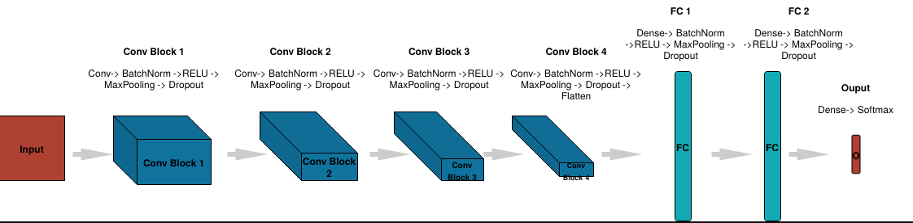

## Challenges in Representation Learning: Facial Expression Recognition Challenge

This project uses the FER2013.csv dataset from the Kaggle Competition. In this project, we develop a facial expression recognition model using Convolutional Neural Network (CNN) and deploy the trained model to a web interface with Flask that enable the users to detect facial expression in real-time or on video/image data.

Before anything else, 
- Download the fer2013.csv dataset from https://www.kaggle.com/deadskull7/fer2013 

In this project, we developed two different models : 
- Model 1: with all 7 universal facial expression (Validation Accuracy = 0.64)
- Model 2: 6 out of 7 universal facial expression - w/o disgust (Validation Accuracy = 0.62)

The CNN model used in this project is inspired by Goodfellow, I.J., et.al. (2013). Challenged in representation learning: A report of three machine learning contests. Neural Networks, 64, 59-63. https://arxiv.org/abs/1307.0414

Usage:
- Use array_to_image.ipynb to transform the array in fer_2013.csv to image.
- Modify camera.py to suit your purpose.
- In Line 6/7, you can choose to use version 1 or version 2.
- In line 12/13, you can choose to either use 0 (connect to your own webcam) or your own video.

#### Example when applied our model to one of our video clips:

Reference: https://www.kaggle.com/c/challenges-in-representation-learning-facial-expression-recognition-challenge/overview/description
